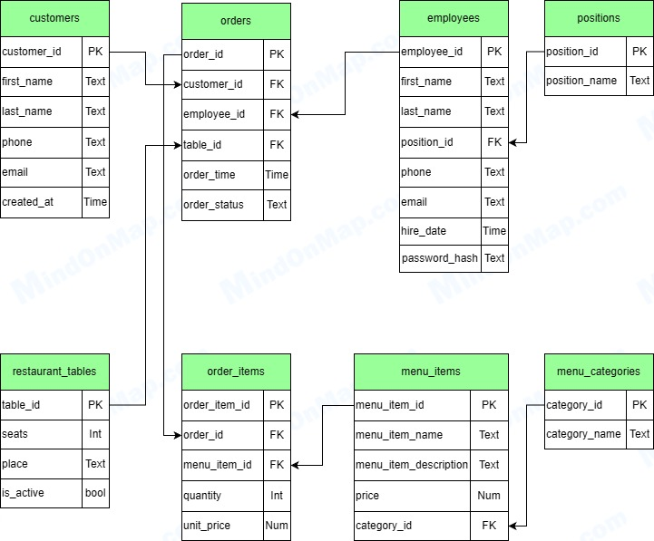

# Звіт з лабораторної роботи №4

## Загальна інформація
- ПІБ студента: Поліщук Андрій Володимироіич
- Група: ІПЗ-32
- Варіант (предметна область): База даних ресторану
- Рівень виконання: 3

## Опис предметної області
### Загальний огляд
Розроблювана інформаційна система призначена для автоматизації управлінських та операційних процесів ресторану. Основною метою системи є підвищення ефективності обслуговування клієнтів, забезпечення цілісності даних про фінансові операції, управління персоналом та ведення актуального меню. Система виступає центральним вузлом, що об'єднує роботу залу (офіціанти), кухні (кухарі) та адміністрації.

### Ключові бізнес-процеси
У межах предметної області виділено наступні ключові процеси, які підлягають автоматизації:

Управління меню: Адміністратор має можливість створювати нові категорії страв (наприклад, "Супи", "Десерти"), додавати позиції меню, редагувати їх опис та встановлювати актуальні ціни.

Обслуговування замовлення (Workflow): Життєвий цикл замовлення проходить через чітко визначені стадії:

**NEW:** Офіціант створює замовлення, прив'язуючи його до клієнта та столика.

**PREPARING:** Кухня починає готувати страви.

**READY:** Страви готові до подачі.

**PAID:** Клієнт розрахувався, замовлення закрите (фіскалізація).

**CANCELLED:** Замовлення скасовано (наприклад, через відмову клієнта).

**Бронювання та розміщення:** Система зберігає інформацію про столики, їх розташування (Зал або Тераса) та кількість місць. Реалізовано контроль, що унеможливлює створення нового замовлення на стіл, який вже зайнятий (статус активного замовлення).

**Облік персоналу:** Зберігання даних про працівників, їхні контактні дані, дату найму та посаду. Реалізовано механізм автентифікації (вхід за логіном/паролем) для доступу до системи.

## Концептуальна модель
На основі аналізу предметної області було розроблено ER-діаграму, яка відображає основні сутності системи та зв'язки між ними.



### У системі визначено наступні типи зв'язків:

**Positions — Employees (1:M):**

Зв'язок "Один-до-багатьох". Одна посада (наприклад, "Офіціант") може належати багатьом працівникам, але кожен працівник має лише одну посаду.

**MenuCategories — MenuItems (1:M):**

Зв'язок "Один-до-багатьох". Одна категорія (наприклад, "Супи") містить багато страв, але кожна страва належить лише до однієї категорії.

**Customers — Orders (1:M):**

Зв'язок "Один-до-багатьох". Один зареєстрований клієнт може зробити безліч замовлень протягом часу, але кожне конкретне замовлення прив'язане до одного клієнта.

**Employees — Orders (1:M):**

Зв'язок "Один-до-багатьох". Один офіціант обслуговує багато замовлень, проте за кожним замовленням закріплений один відповідальний працівник.

**RestaurantTables — Orders (1:M):**

Зв'язок "Один-до-багатьох". За одним столом може бути оформлено багато замовлень (у різний час), але конкретне замовлення завжди прив'язане до одного столу.

**Orders — MenuItems (M:M):**

Зв'язок "Багато-до-багатьох". Одне замовлення може містити багато різних страв, і одна страва може входити у багато різних замовлень.

Реалізація: Цей зв'язок розкрито через проміжну сутність OrderItems, яка фіксує кількість (quantity) та ціну на момент продажу (unit_price).

## Логічна схема
База даних спроєктована відповідно до принципів Третьої нормальної форми (3NF), що забезпечує мінімізацію надлишковості даних та їхню цілісність. Архітектура системи розділена на чотири логічні групи таблиць.

Таблиця **positions** визначає перелік посад (Офіціант, Адміністратор тощо), що дозволяє керувати ролями персоналу. Структура меню організована через таблицю **menu_categories**, до якої прив'язуються конкретні страви. Конфігурація залу (кількість місць, розташування на терасі чи в залі) зберігається у таблиці **restaurant_tables**, яка також має прапорець активності для тимчасового закриття столиків.

Дані про людей та продукти зберігаються в основних таблицях. Таблиця **employees** містить профілі працівників і посилається на їхні посади через зовнішній ключ; для безпеки входу тут також зберігається хеш пароля. Інформація про страви міститься в **menu_items**, де кожна позиція прив'язана до своєї категорії. База контактів гостей ведеться у таблиці **customers**, що дозволяє персоналізувати обслуговування.

Центральним елементом системи є таблиця **orders**, яка фіксує факт надання послуги. Вона об'єднує в собі посилання на клієнта, відповідального працівника та зайнятий стіл, а також відстежує життєвий цикл замовлення через систему статусів (NEW → PAID).

Зв'язок "багато-до-багатьох" між замовленнями та меню реалізовано через таблицю деталізації **order_items**. Важливою особливістю цієї таблиці є збереження історичної ціни (unit_price) на момент продажу. Це гарантує, що зміна цін у меню в майбутньому не спотворить фінансову звітність за минулі періоди.

Для контролю дій персоналу створено службові таблиці, які заповнюються автоматично через тригери. Таблиця **order_audit** фіксує історію змін статусів замовлень та факти їх видалення, забезпечуючи прозорість операцій.

## Реалізація в PostgreSQL

```sql
CREATE TABLE positions (
    position_id SERIAL PRIMARY KEY,
    position_name VARCHAR(50) NOT NULL UNIQUE
);

CREATE TABLE customers (
    customer_id SERIAL PRIMARY KEY,
    first_name VARCHAR(50) NOT NULL,
    last_name VARCHAR(50) NOT NULL,
    phone VARCHAR(15) NOT NULL,
    email VARCHAR(50) NOT NULL,
    created_at TIMESTAMP DEFAULT CURRENT_TIMESTAMP
);

CREATE TABLE employees (
    employee_id SERIAL PRIMARY KEY,
    first_name VARCHAR(50) NOT NULL,
    last_name VARCHAR(50) NOT NULL,
    position_id INT NOT NULL REFERENCES positions(position_id),
    phone VARCHAR(15) NOT NULL,
    email VARCHAR(50) NOT NULL,
    hire_date TIMESTAMP DEFAULT CURRENT_TIMESTAMP
);

ALTER TABLE employees
ADD COLUMN password_hash VARCHAR(300);

CREATE TABLE restaurant_tables(
    table_id SERIAL PRIMARY KEY,
    seats INT NOT NULL,
    place VARCHAR(50) NOT NULL CHECK (place IN ('Hall', 'Terrace')),
    is_active BOOLEAN NOT NULL
);

CREATE TABLE menu_categories (
    category_id SERIAL PRIMARY KEY,
    category_name VARCHAR(50) NOT NULL UNIQUE
);

CREATE TABLE menu_items (
    menu_item_id SERIAL PRIMARY KEY,
    menu_item_name VARCHAR(50) NOT NULL UNIQUE,
    category_id INT NOT NULL REFERENCES menu_categories(category_id),
    menu_item_description VARCHAR(200) NOT NULL,
    price NUMERIC(10,2) NOT NULL
);


CREATE TABLE orders (
    order_id SERIAL PRIMARY KEY,
    customer_id INT NOT NULL REFERENCES customers(customer_id),
    employee_id INT NOT NULL REFERENCES employees(employee_id),
    table_id INT NOT NULL REFERENCES restaurant_tables(table_id),
    order_time TIMESTAMP DEFAULT CURRENT_TIMESTAMP,
    order_status VARCHAR(20) NOT NULL CHECK (order_status IN ('NEW', 'PREPARING', 'READY', 'PAID', 'CANCELLED'))
);
   
CREATE TABLE order_items (
    order_item_id SERIAL PRIMARY KEY,
    order_id INT NOT NULL REFERENCES orders(order_id),
    menu_item_id INT NOT NULL REFERENCES menu_items(menu_item_id),
    quantity INT NOT NULL CHECK (quantity > 0),
    unit_price NUMERIC(10,2) NOT NULL
);


CREATE INDEX idx_orders_customer_id ON orders(customer_id);
CREATE INDEX idx_orders_employee_id ON orders(employee_id);
CREATE INDEX idx_orders_table_id ON orders(table_id);
CREATE INDEX idx_orders_status ON orders(order_status);
CREATE INDEX idx_orders_time ON orders(order_time);
CREATE INDEX idx_order_items_order_id ON order_items(order_id);
CREATE INDEX idx_order_items_menu_item_id ON order_items(menu_item_id);
CREATE INDEX idx_menu_items_category ON menu_items(category_id);
```

## Налаштування Docker
Для забезпечення відтворюваності середовища, ізоляції компонентів та спрощення розгортання системи використано технологію контейнеризації Docker та інструмент оркестрації Docker Compose.

### Архітектура сервісів
Файл конфігурації *docker-compose.yml* описує взаємодію трьох ключових контейнерів, об'єднаних у спільну мережу db_network:

**postgres:**

Образ: Використовується офіційний образ postgres:15.

Ініціалізація: Ключовою особливістю є монтування локальної папки ./database у системну директорію контейнера /docker-entrypoint-initdb.d. Це гарантує, що при першому запуску автоматично виконаються всі SQL-скрипти створення таблиць, процедур та наповнення даними.

**web:**

Збірка: Контейнер збирається з локального Dockerfile, що встановлює Python 3.11 та необхідні бібліотеки (Flask, psycopg).

Синхронізація запуску: Визначено залежність depends_on: postgres. Додатково у команду запуску додано затримку (sleep 5), щоб дати базі даних час на повну ініціалізацію перед спробою підключення застосунку.

Порти: Застосунок доступний на порту 5000.

**pgadmin:**

Образ: dpage/pgadmin4.

Призначення: Надає зручний графічний вебінтерфейс для керування базою даних, перегляду таблиць та виконання SQL-запитів вручну. Доступний на порту 5050.

## SQL-запити
### Статистика по категоріях меню
```sql
    SELECT 
    mc.category_name AS category,
    COUNT(mi.menu_item_id) AS items_count, 
    AVG(mi.price) AS avg_price,
    MIN(mi.price) AS min_price,
    MAX(mi.price) AS max_price
    FROM menu_categories mc 
    INNER JOIN menu_items mi ON mc.category_id = mi.category_id
    GROUP BY mc.category_name
    ORDER BY avg_price DESC;
```
#### Пояснення: 
Виводить інформацію про категорії товарів, а саме кількість страв в цій категорії, мінімальну та максимальну ціну страв категорії і середню вартість усіх страв в категорії. 

#### Результат виконання:


### Огляд замовлень 
```sql
SELECT 
    o.order_id,
    c.first_name || ' ' || c.last_name AS customer_name,
    o.order_time,
    o.order_status,
    SUM(oi.quantity * oi.unit_price) AS total_amount
FROM orders o
INNER JOIN customers c ON o.customer_id = c.customer_id
INNER JOIN order_items oi ON o.order_id = oi.order_id
GROUP BY o.order_id, c.first_name, c.last_name, o.order_time, o.order_status
ORDER BY total_amount DESC;
```
#### Пояснення:
Виводить інформацію про замовлення, а саме клієнт, час створення замовлення, статус і загальну вартість.

#### Результат виконання:


### Топ-10 страв за кількістю замовлень
```sql
SELECT 
    mi.menu_item_name,
    mc.category_name,
    COUNT(oi.order_item_id) AS times_ordered,
    SUM(oi.quantity * oi.unit_price) AS total_revenue
FROM menu_items mi
LEFT JOIN order_items oi ON mi.menu_item_id = oi.menu_item_id
JOIN menu_categories mc ON mi.category_id = mc.category_id
GROUP BY mi.menu_item_id, mi.menu_item_name, mc.category_name
ORDER BY times_ordered DESC
LIMIT 10;
```
#### Пояснення:
Виводить список з стравами, які було замовлено найбільшу кількість разів. Для визначення найпопулярніших страв використовується агрегація кількості замовлень та суми виручки.

#### Результат виконання:


### Пошук
```sql
SELECT * FROM menu_items 
WHERE menu_item_name ILIKE '%борщ%' 
   OR menu_item_description ILIKE '%борщ%';
```
#### Пояснення:
Виводить записи з меню, назва або опис яких містить слово 'борщ'.

#### Результат виконання:


## Вебзастосунок
### Головна сторінка


### Меню


### Замовлення


### Клієнти


### Персонал


### Статистика


### Логи


### Сторінка входу


## Висновки
В ході виконання лабораторної роботи було спроєктовано та реалізовано повноцінну інформаційну систему для автоматизації діяльності ресторану.

Основні результати:

1. Розроблено нормалізовану схему бази даних (3NF) у PostgreSQL.

2. Реалізовано серверну бізнес-логіку з використанням збережених процедур (розрахунок фінансів) та тригерів (аудит, валідація зайнятості столів).

3. Створено вебзастосунок на Flask, який забезпечує зручну взаємодію користувачів із системою.

4. Впроваджено механізми захисту даних (хешування паролів) та розмежування прав доступу (RBAC).

5. Налаштовано автоматичне розгортання через Docker Compose, що робить систему легкою для встановлення та масштабування.

Отримані навички дозволяють розробляти складні, надійні та захищені інформаційні системи, готові до використання в реальних умовах.